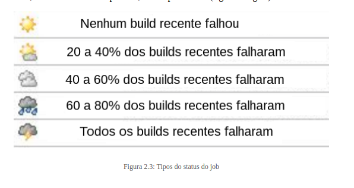

# JOB

Um job é uma tarefa que o Jenkins deve fazer. Normalmente, tem alguns parâmetros de execução, juntamente com alguns procedimentos que podem ser feitos antes ou depois de sua execução. Por exemplo, um job de build de uma aplicação web, ou job de execução de um conjunto de testes. O mesmo job normalmente tem um ou mais builds.

# Build

É a construção, uma execução de um job (tarefa), por exemplo o procedimento de montar um pacote, que pode envolver download, compilação ou testes. O build pode ser considerado como uma instância de um job, como o último processo de um job de deploy. Ele também possui diferentes status:

1. Falha no Build (RED)
2. Build Instavel (YELLOW)
3. Build Feito Com Sucesso (BLUE)
5. Build Pendente (GRAY)
6. Build Cancelado (GRAY)
7. Build Desligado (GRAY)

# Pipeline

Um job pode ter dependência com outro job; se um for acionado, ao terminar, pode chamar o outro automaticamente, criando uma cadeia de jobs enfileirados, parecendo com uma "linha de canos" ( pipeline , figura a seguir). Um exemplo é um job de build da aplicação web estar ligado ao job de deploy dessa mesma aplicação.

# Plugins

A integração do Jenkins, o nosso superexecutor de tarefas, com os diversos tipos de servidores e sistemas é feita por meio de plugins, não só para melhorar um funcionamento existente, mas também para criar um que não existe.

# Artifact

Artifact (ou artefato) é o pacote resultante de um build executado com sucesso. Ele pode ser um arquivo pom.xml , JAR , WAR , EAR etc.

# Dashboard e view

O Dashboard (ou painel principal) é o local em que temos uma visão completa da execução de todos os jobs do Jenkins. Ele pode ser dividido em views específicas tudo bem, e se temos uma tempestade, temos problemas (figura a seguir).

